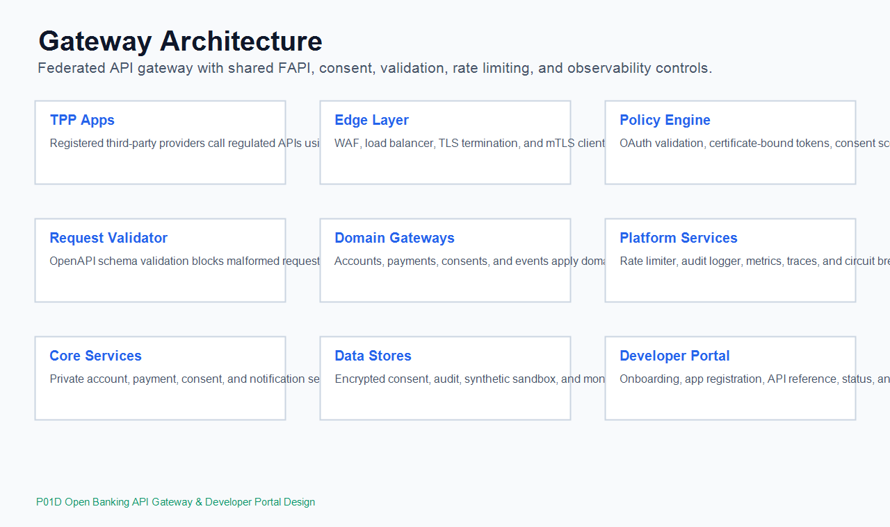

# Zetheta Project Metadata

- ZETHETA_INTERN_ID: PENDING_ZETHETA_ISSUED_ID
- ZETHETA_PROJECT_CODE: P01D
- ZETHETA_PROJECT_TITLE: Open Banking API Gateway & Developer Portal Design
- INTERN_NAME: Radhika Dwivedi
- SUBMISSION_DATE: 2026-06-26

# Open Banking API Gateway & Developer Portal

This repository contains the design artefacts for a simulated mid-size bank launching an Open Banking API platform. The project covers gateway architecture, OAuth 2.0/FAPI security, consent management, OpenAPI 3.0 specifications, developer portal design, sandbox design, monitoring, and API governance.

## Architecture Diagram



## Quick Start

1. Review `docs/architecture/regulatory-comparison.md`.
2. Read the gateway and security architecture in `docs/architecture/`.
3. Inspect API specifications in `docs/api-specs/`.
4. Run OpenAPI linting:

```bash
npm install
npm run lint:openapi
```

5. Run all local validation checks:

```bash
npm test
```

6. Start the deterministic sandbox mock server after installing dependencies:

```bash
npm run mock:sandbox
```

7. Or start one OpenAPI-backed Prism mock by API domain:

```bash
npm run mock:accounts
```

## Repository Structure

```text
docs/
  architecture/
  api-specs/
  developer-portal/
  governance/
  sandbox/
src/
  gateway-config/
  mock-server/
  postman-collections/
tests/
  api-contract-tests/
  openapi-lint/
```

## Standards Covered

| Area | Standard / Practice |
| --- | --- |
| API description | OpenAPI 3.0.3 |
| Authorization | OAuth 2.0 Authorization Code with PKCE |
| Financial API hardening | FAPI 1.0 Advanced concepts |
| Transport security | TLS 1.2+, mTLS, certificate-bound tokens |
| Open banking references | PSD2, UK Open Banking, India AA, Australia CDR |
| Governance | Versioning, deprecation, rate limiting, monitoring |

## API Summary

| API | Spec | Example Endpoints |
| --- | --- | --- |
| Consent | `docs/api-specs/openapi-consents.yaml` | `POST /consents`, `GET /consents/{consentId}` |
| Accounts | `docs/api-specs/openapi-accounts.yaml` | `GET /accounts`, `GET /accounts/{accountId}/transactions` |
| Payments | `docs/api-specs/openapi-payments.yaml` | `POST /domestic-payment-consents`, `POST /domestic-payments` |
| Events | `docs/api-specs/openapi-events.yaml` | `POST /event-subscriptions`, `POST /events` |

## Local Validation Evidence

- `npm run lint:openapi`: Spectral validation for all OpenAPI files.
- `npm run test:postman`: verifies the exported Postman collection covers all 22 required requests and shared test assertions.
- `npm run test:mock-server`: verifies sandbox success responses and deterministic error triggers.

## Final Metadata Note

`ZETHETA_INTERN_ID` is intentionally marked `PENDING_ZETHETA_ISSUED_ID` until Zetheta issues the final intern identifier.
