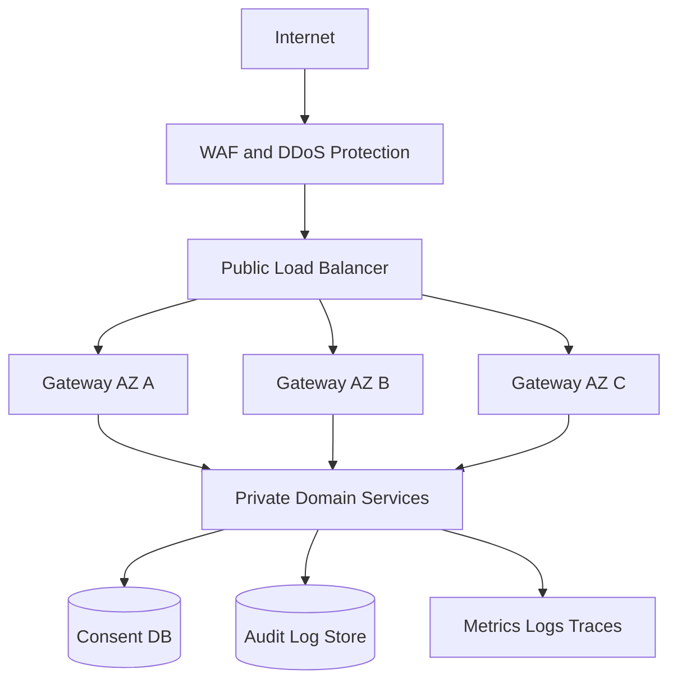

# Deployment Topology

```mermaid
flowchart TB
  Internet --> WAF[WAF and DDoS Protection]
  WAF --> LB[Public Load Balancer]
  LB --> GWA[Gateway AZ A]
  LB --> GWB[Gateway AZ B]
  LB --> GWC[Gateway AZ C]
  GWA --> Services[Private Domain Services]
  GWB --> Services
  GWC --> Services
  Services --> ConsentDB[(Consent DB)]
  Services --> Audit[(Audit Log Store)]
  Services --> Observability[Metrics Logs Traces]
```

The gateway is deployed across three availability zones. Backend services and databases are private. Audit logs are immutable and retained according to regulatory policy.
