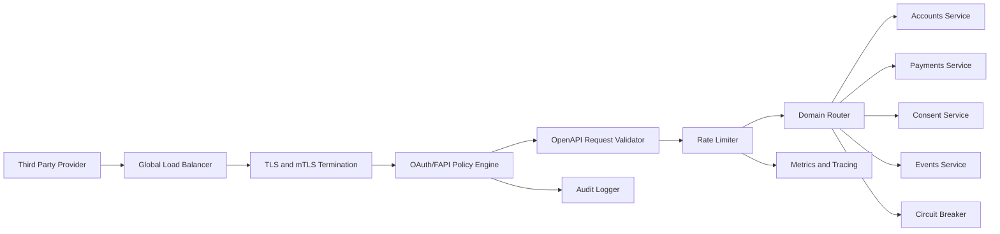

# Gateway Architecture

## Executive Summary

The proposed platform uses a federated gateway pattern: separate logical gateway policies for accounts, payments, consents, and events, backed by shared identity, audit, developer portal, and monitoring services. This provides clearer isolation for high-risk payment flows while keeping shared governance consistent.

## Selected Pattern

| Pattern | Fit | Rationale |
| --- | --- | --- |
| Centralized gateway | Medium | Simple, but all domains share one blast radius. |
| Federated gateway by domain | High | Separates risk profiles and policies across accounts, payments, consent, and events. |
| BFF + gateway | Medium | Useful for portal UI, less relevant for third-party API traffic. |
| Service mesh + thin gateway | Medium | Strong internal security but more operational complexity. |

## Component Diagram

## Core Gateway Responsibilities

- Terminate TLS and enforce mTLS for regulated clients.
- Validate JWT access tokens, OAuth scopes, consent IDs, and certificate binding.
- Validate requests against OpenAPI schemas.
- Apply endpoint-specific rate limits and burst policies.
- Route traffic to domain services.
- Normalize error responses.
- Emit audit logs for regulatory investigations.
- Publish metrics for operational monitoring.

## Technology Selection

| Option | Strength | Risk |
| --- | --- | --- |
| Kong Gateway | Plugin ecosystem, declarative config, strong open-source base | Some enterprise features may require paid edition |
| Apigee | Mature lifecycle, analytics, portal | Cost and vendor lock-in |
| AWS API Gateway | Managed scaling | Cloud-specific customization limits |
| Tyk | Open-source option with portal support | Smaller ecosystem than Kong/Apigee |

## Recommendation

Kong or Apigee are the strongest candidates. For this simulated bank, Kong is selected because it supports declarative gateway configuration, custom plugins, rate limiting, request validation, and can be deployed in a cloud-neutral manner.

## Deployment Topology

- Region: primary cloud region near the bank's core banking systems.
- Availability: at least three availability zones.
- Entry: public load balancer with WAF and DDoS protection.
- Gateway: horizontally scaled gateway cluster.
- Services: private subnets only.
- Data: consent database encrypted at rest.
- Observability: centralized logs, metrics, traces, and audit stream.

## Request Flow

1. A regulated TPP sends traffic to the public API hostname through TLS.
2. The load balancer applies WAF and DDoS controls before forwarding to the gateway cluster.
3. The gateway validates the client certificate where mTLS is required.
4. The OAuth/FAPI policy engine validates token signature, expiry, audience, issuer, scope, and certificate binding.
5. The consent policy checks that the token is attached to an active consent and that the requested endpoint is allowed by the consent permissions.
6. The OpenAPI validator rejects malformed paths, headers, query parameters, and request bodies before backend services are reached.
7. The rate limiter applies per-TPP, per-endpoint, and platform-level limits.
8. The router sends the request to the appropriate domain service.
9. Responses are transformed into the common envelope and error taxonomy.
10. Audit logs, metrics, and traces are emitted for regulatory evidence and operations.

## Technology Rationale

Kong is selected for the simulated implementation because the assessment needs a design that is practical to demonstrate without requiring a proprietary enterprise platform. Kong supports declarative configuration, plugins, rate limiting, request transformation, authentication integration, and horizontal scaling. Apigee would be a strong enterprise choice when commercial API monetisation and analytics are the primary driver, but its cost and managed-service assumptions are less suitable for a student submission. AWS API Gateway is operationally attractive for an AWS-only bank, but a regulated open banking platform benefits from cloud-neutral controls and portability. Tyk remains a viable alternative, especially for teams wanting an open-source gateway and portal bundle, but Kong has broader ecosystem examples for plugin-driven policy enforcement.

## Control Boundaries

The gateway is deliberately not responsible for core banking business rules. It enforces edge controls: authentication, authorization, schema validation, rate limiting, request routing, protocol consistency, and observability. Domain services remain responsible for account ownership rules, payment execution decisions, ledger integrity, customer records, and event generation. This split keeps gateway policy stable while allowing each banking domain to evolve independently.

## Failure Handling

The gateway should fail closed for identity, consent, certificate, and schema checks. If the consent store or authorization server is unavailable, regulated resource calls return a controlled `503` or `401/403` depending on the failure point rather than bypassing validation. Circuit breakers isolate unhealthy domain services, and retry behaviour is limited to idempotent requests. Payment initiation endpoints rely on `x-idempotency-key` and server-side deduplication to prevent duplicate payment execution during network retries.

## Diagram Exports

The canonical component diagram is embedded above in Mermaid and exported as `docs/architecture/diagrams/gateway-architecture.png` for submission review.
