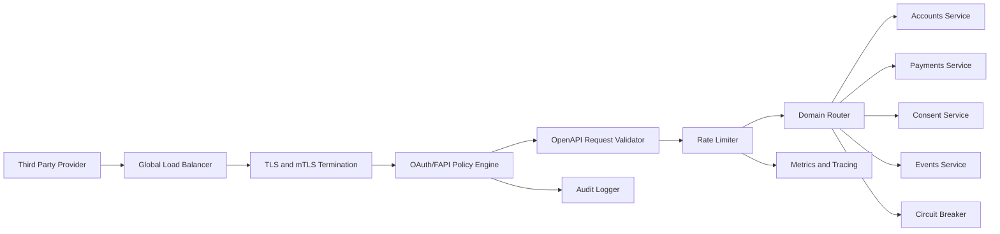

# Gateway Architecture

## Executive Summary

The proposed platform uses a federated gateway pattern: separate logical gateway policies for accounts, payments, consents, and events, backed by shared identity, audit, developer portal, and monitoring services. This provides clearer isolation for high-risk payment flows while keeping shared governance consistent.

## Selected Pattern

| Pattern | Fit | Rationale |
| --- | --- | --- |
| Centralized gateway | Medium | Simple, but all domains share one blast radius. |
| Federated gateway by domain | High | Separates risk profiles and policies across accounts, payments, consent, and events. |
| BFF + gateway | Medium | Useful for portal UI, less relevant for third-party API traffic. |
| Service mesh + thin gateway | Medium | Strong internal security but more operational complexity. |

## Component Diagram

## Core Gateway Responsibilities

- Terminate TLS and enforce mTLS for regulated clients.
- Validate JWT access tokens, OAuth scopes, consent IDs, and certificate binding.
- Validate requests against OpenAPI schemas.
- Apply endpoint-specific rate limits and burst policies.
- Route traffic to domain services.
- Normalize error responses.
- Emit audit logs for regulatory investigations.
- Publish metrics for operational monitoring.

## Technology Selection

| Option | Strength | Risk |
| --- | --- | --- |
| Kong Gateway | Plugin ecosystem, declarative config, strong open-source base | Some enterprise features may require paid edition |
| Apigee | Mature lifecycle, analytics, portal | Cost and vendor lock-in |
| AWS API Gateway | Managed scaling | Cloud-specific customization limits |
| Tyk | Open-source option with portal support | Smaller ecosystem than Kong/Apigee |

## Recommendation

Kong or Apigee are the strongest candidates. For this simulated bank, Kong is selected because it supports declarative gateway configuration, custom plugins, rate limiting, request validation, and can be deployed in a cloud-neutral manner.

## Deployment Topology

- Region: primary cloud region near the bank's core banking systems.
- Availability: at least three availability zones.
- Entry: public load balancer with WAF and DDoS protection.
- Gateway: horizontally scaled gateway cluster.
- Services: private subnets only.
- Data: consent database encrypted at rest.
- Observability: centralized logs, metrics, traces, and audit stream.

## TODO

- Add a draw.io or exported PNG diagram in `docs/architecture/diagrams/`.
- Expand this to 1,500-2,500 words with your rationale and citations.
