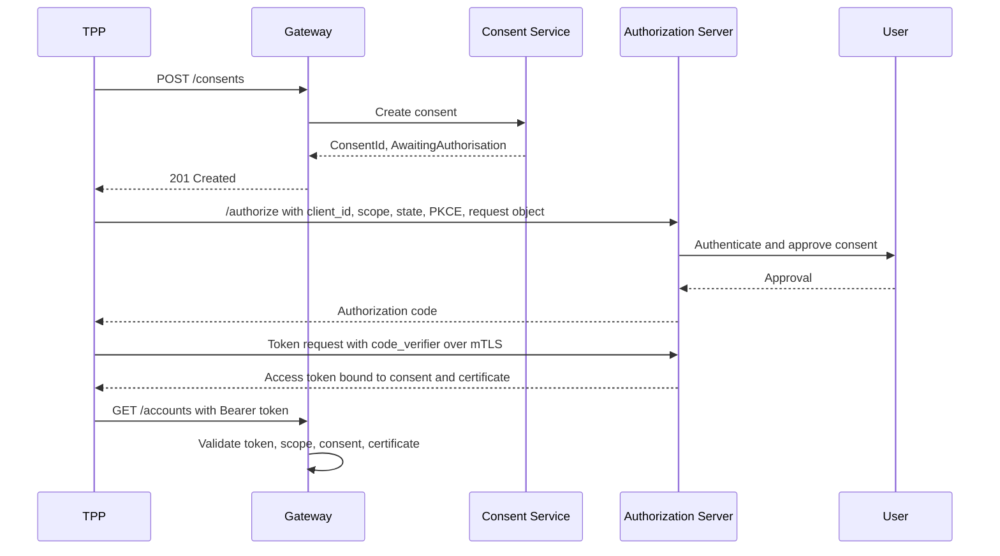
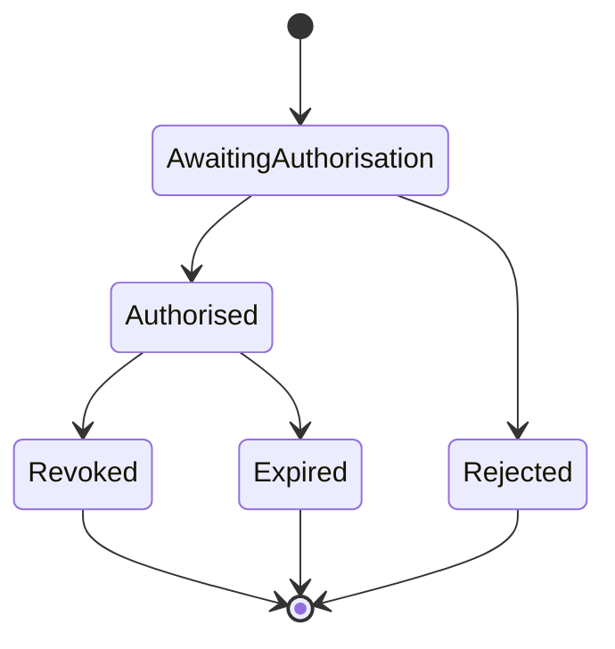

# Security Architecture

## Overview

The security model combines OAuth 2.0 Authorization Code Flow with PKCE, FAPI-aligned controls, mTLS, signed authorization requests, consent-bound tokens, and detailed audit logging.

## Authorization Code with PKCE

## FAPI 1.0 Advanced Controls

| Control | Design Treatment |
| --- | --- |
| mTLS | Required for token endpoint and high-risk API calls. |
| PKCE | Required for authorization code flow. |
| PAR | Authorization parameters pushed through back channel. |
| JARM | Authorization response returned as signed JWT. |
| Signed request object | Prevents front-channel tampering. |
| Certificate-bound tokens | Reduces replay risk if token is stolen. |

## Token Lifecycle

- Access tokens: short lived, consent-bound, scope-limited.
- Refresh tokens: rotated on use and revoked when consent is revoked.
- ID tokens: issued only where OIDC identity context is needed.
- Revocation: triggered by customer action, TPP deregistration, fraud event, or expiry.

## Certificate Management

- PSD2: eIDAS QWAC/QSEAL concepts.
- UK Open Banking: OBWAC/OBSEAL concepts.
- Australia CDR: register-backed certificates.
- Platform rule: all certificates are validated against trusted directories and revocation status.

## Consent States

## TODO

- Expand with payment initiation and revocation sequence diagrams.
- Add threat model details from `threat-model.md`.
