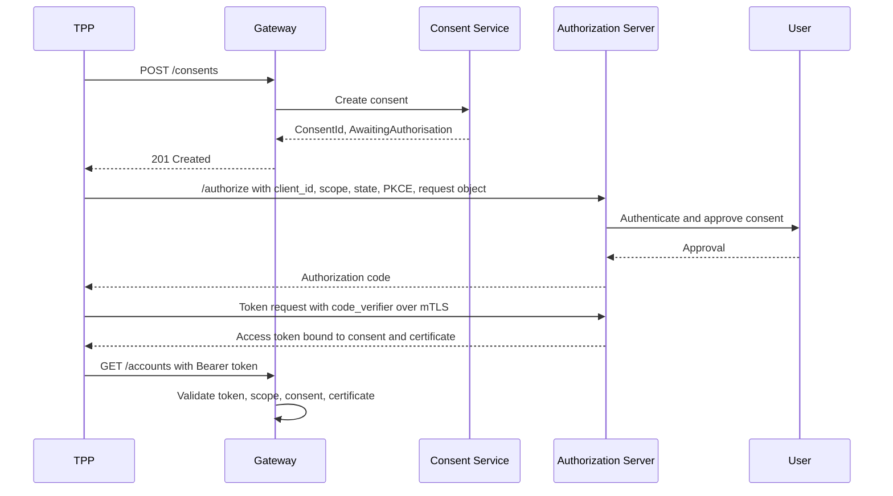
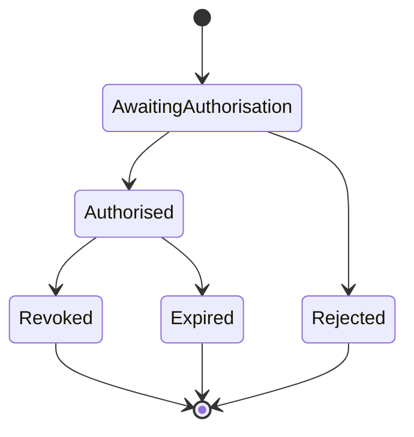
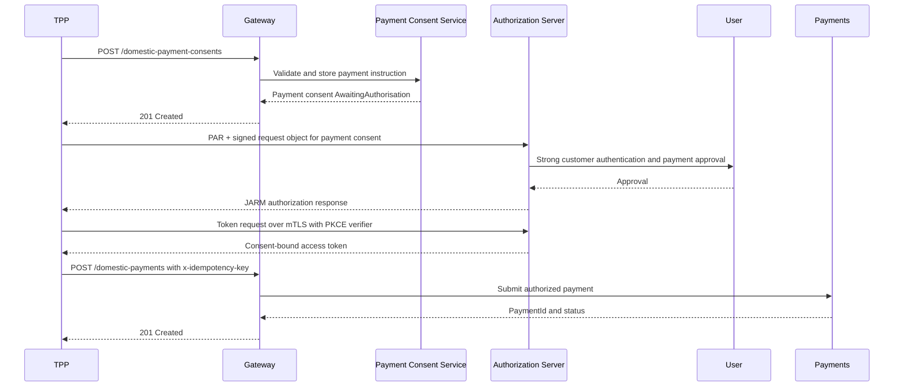
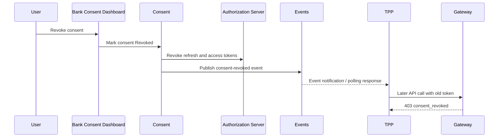

# Security Architecture

## Overview

The security model combines OAuth 2.0 Authorization Code Flow with PKCE, FAPI-aligned controls, mTLS, signed authorization requests, consent-bound tokens, and detailed audit logging.

The design principle is defense in depth. No single control is treated as sufficient for open banking access. A request must come from a registered client, use the expected certificate where mTLS applies, carry a valid token, match the token audience and scope, map to an active consent, pass OpenAPI validation, and satisfy rate limit and risk checks. This approach is stricter than a normal consumer API because open banking exposes sensitive financial data and payment capability to third-party applications.

The gateway, authorization server, consent service, and certificate trust layer have separate responsibilities. The authorization server issues tokens and handles customer authentication. The consent service stores permissions, expiry, revocation, and customer decisions. The gateway enforces policy before routing. The certificate layer proves client possession of trusted keys. Separating these responsibilities avoids overloading OAuth tokens with decisions that belong to consent or certificate validation.

## Authorization Code with PKCE

In this flow, PKCE protects the authorization code by requiring the TPP to prove possession of the original `code_verifier` during token exchange. The authorization request includes `state` to protect against cross-site request forgery and response mix-up. Redirect URIs are exact-match only, which prevents a malicious application from receiving authorization codes through an unregistered redirect.

The customer does not approve a broad "bank access" permission. The consent journey should show requested permissions, data categories, expiry date, and the TPP name. This creates usable consent evidence for support, audits, and future dispute handling.

## FAPI 1.0 Advanced Controls

| Control | Design Treatment |
| --- | --- |
| mTLS | Required for token endpoint and high-risk API calls. |
| PKCE | Required for authorization code flow. |
| PAR | Authorization parameters pushed through back channel. |
| JARM | Authorization response returned as signed JWT. |
| Signed request object | Prevents front-channel tampering. |
| Certificate-bound tokens | Reduces replay risk if token is stolen. |

### Control Rationale

FAPI controls are selected because OAuth 2.0 by itself is a framework, not a complete high-assurance financial API profile. Standard OAuth deployments can be secure, but they often leave choices open around client authentication, front-channel integrity, token sender constraint, and authorization response protection. FAPI narrows those choices for financial use cases.

PAR is valuable because authorization parameters such as scopes, consent IDs, claims, and redirect details are sent through a direct back-channel request instead of only through the browser. This reduces tampering and leakage. JARM then signs the authorization response so the client can verify that the response came from the authorization server and was not modified in transit. Signed request objects protect the authorization request, while mTLS and certificate-bound tokens make token replay harder.

The tradeoff is complexity. FAPI increases implementation effort for both the bank and TPPs. Developers must manage certificates, signed JWTs, redirect handling, and stricter error cases. The developer portal and sandbox therefore need strong onboarding documentation, certificate tooling, and troubleshooting guidance. The design accepts this complexity because payment initiation and sensitive account access justify stronger controls.

## Token Lifecycle

- Access tokens: short lived, consent-bound, scope-limited.
- Refresh tokens: rotated on use and revoked when consent is revoked.
- ID tokens: issued only where OIDC identity context is needed.
- Revocation: triggered by customer action, TPP deregistration, fraud event, or expiry.

### Access Tokens

Access tokens are short-lived bearer or sender-constrained tokens used to call resource APIs. They include issuer, audience, expiry, subject/client identity, scope, consent reference, and confirmation claim where certificate binding applies. The gateway validates the token signature and claims on every request. A token for account information cannot be reused for payment submission unless the scope and consent explicitly allow it.

Recommended simulated lifetime: 5 to 15 minutes for high-risk payment tokens and up to 30 minutes for read-only account access tokens. Short lifetimes reduce exposure if a token leaks. The cost is more frequent refresh operations, which is acceptable because refresh tokens are rotated and monitored.

### Refresh Tokens

Refresh tokens are longer-lived but more sensitive. They are rotated on every use, meaning a previously used refresh token becomes invalid. Reuse of an old refresh token is treated as a possible compromise and triggers revocation of the token family. Refresh tokens are revoked immediately when a customer revokes consent, when consent expires, when a TPP is suspended, or when certificate binding is invalidated.

### ID Tokens

ID tokens are used only where OpenID Connect identity context is required for the customer journey. Resource APIs should not rely on ID tokens for data access decisions. The gateway authorizes resource calls using access tokens and consent state rather than ID token claims.

### Revocation and Introspection

The gateway may validate JWTs locally for performance, but it still needs a way to detect revoked consent and suspended clients. The design therefore uses consent-state lookup or cached introspection for sensitive operations. Cache TTLs are short for payments and consent changes. Revocation events are also published through the event service so TPPs can clean up stored state.

## Certificate Management

- PSD2: eIDAS QWAC/QSEAL concepts.
- UK Open Banking: OBWAC/OBSEAL concepts.
- Australia CDR: register-backed certificates.
- Platform rule: all certificates are validated against trusted directories and revocation status.

### Certificate Lifecycle

1. Registration: the TPP registers application metadata, redirect URIs, contacts, and certificate information in the developer portal or trusted directory.
2. Validation: the bank validates the certificate chain, issuer trust, expiry, key usage, and revocation status.
3. Binding: the client identifier is bound to certificate thumbprints or subject details used during mTLS authentication.
4. Rotation: certificates are rotated before expiry. The portal should allow overlapping old and new certificates during a controlled migration window.
5. Revocation: compromised, expired, or deregistered certificates are blocked at the mTLS layer and token endpoint.
6. Audit: certificate changes are logged with actor, timestamp, old value, new value, and approval record.

Certificate rotation is a practical operational risk. If the platform only allows one active certificate, a TPP can experience downtime during rotation. If it allows unlimited certificates, the attack surface grows. The recommended design allows a small number of active certificates per application with expiry reminders, approval workflow, and clear audit history.

### Regime Differences

PSD2, UK Open Banking, and Australia CDR use different trust frameworks and naming conventions, but the gateway can treat them through a common abstraction: trusted issuer, valid chain, non-revoked certificate, registered client binding, and allowed API products. This keeps the internal architecture consistent while allowing jurisdiction-specific validation rules.

## Consent States

Consent is the business authorization record. Tokens must reference an active consent, and consent permissions must be checked against the requested endpoint. For example, a token linked to `ReadAccountsBasic` can list accounts but should not retrieve detailed transactions unless `ReadTransactionsBasic` or `ReadTransactionsDetail` is present. This prevents scope drift and supports clear customer control.

Consent expiry is enforced independently of token expiry. If a token is still cryptographically valid but the consent has expired or been revoked, the gateway returns a consent-specific `403` error. This behaviour is more secure than relying only on token lifetime.

## Payment Initiation Flow

## Consent Revocation Flow

## Threat Model Linkage

The threat model focuses on ten risks called out in the brief: injection, broken authentication, excessive data exposure, rate limiting bypass, consent scope escalation, token theft, certificate spoofing, replay attacks, CSRF in the consent flow, and insider threat. The security architecture mitigates these through OpenAPI validation, PKCE, mTLS, PAR, JARM, signed request objects, certificate-bound access tokens, least-privilege scopes, consent-to-token binding, and immutable audit logs.

## Security Tradeoffs

| Decision | Benefit | Tradeoff | Mitigation |
| --- | --- | --- | --- |
| Require FAPI-style controls | Strong protection for financial data and payments | More developer complexity | Sandbox tooling, guides, and detailed errors |
| Use short-lived access tokens | Limits impact of stolen tokens | More refresh traffic | Refresh token rotation and efficient token endpoint scaling |
| Validate consent on each request | Prevents stale or excessive access | Adds latency and dependency on consent service | Short cache TTLs, circuit breakers, fail-closed rules |
| Use mTLS for regulated clients | Strong client authentication and token sender constraint | Certificate lifecycle burden | Portal-assisted rotation and expiry alerts |
| Split gateway policies by domain | Better isolation for payments and events | More configuration to govern | Shared policy templates and CI validation |

The most important tradeoff is between strict security and developer onboarding speed. A weak onboarding journey causes integration delays and support tickets, but weakening security would undermine the purpose of an open banking platform. The design resolves this by keeping strong controls mandatory while making sandbox setup, errors, and documentation as clear as possible.

## Operational Security Rules

- Authorization codes are single-use and expire quickly.
- Access tokens are short-lived and audience-restricted to the resource APIs.
- Refresh tokens are rotated and revoked on consent revocation.
- Payment submission requires an active payment consent and idempotency key.
- Redirect URIs must exactly match registered application metadata.
- All security decisions are logged with `x-fapi-interaction-id`.
- Certificate revocation status is checked during client authentication.
