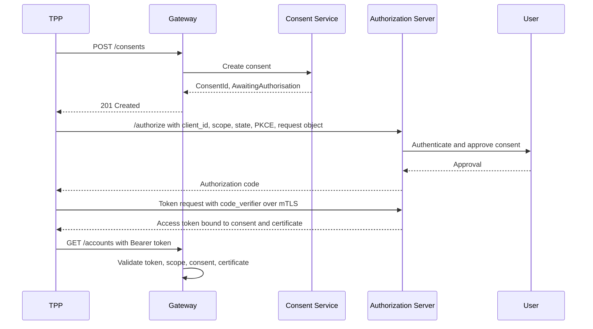
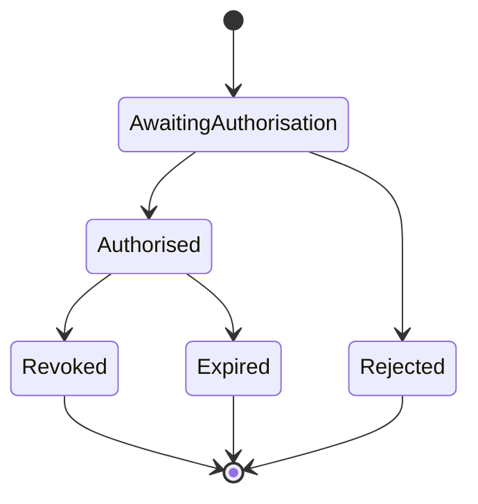
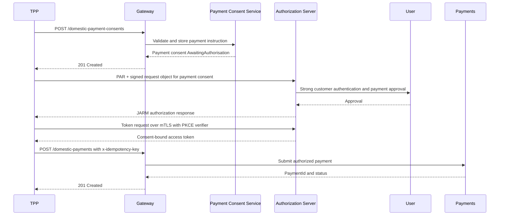
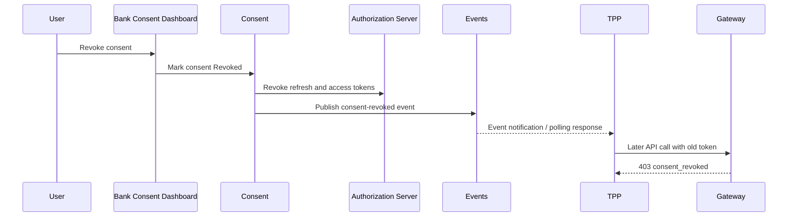

# Security Architecture

## Overview

The security model combines OAuth 2.0 Authorization Code Flow with PKCE, FAPI-aligned controls, mTLS, signed authorization requests, consent-bound tokens, and detailed audit logging.

## Authorization Code with PKCE

## FAPI 1.0 Advanced Controls

| Control | Design Treatment |
| --- | --- |
| mTLS | Required for token endpoint and high-risk API calls. |
| PKCE | Required for authorization code flow. |
| PAR | Authorization parameters pushed through back channel. |
| JARM | Authorization response returned as signed JWT. |
| Signed request object | Prevents front-channel tampering. |
| Certificate-bound tokens | Reduces replay risk if token is stolen. |

## Token Lifecycle

- Access tokens: short lived, consent-bound, scope-limited.
- Refresh tokens: rotated on use and revoked when consent is revoked.
- ID tokens: issued only where OIDC identity context is needed.
- Revocation: triggered by customer action, TPP deregistration, fraud event, or expiry.

## Certificate Management

- PSD2: eIDAS QWAC/QSEAL concepts.
- UK Open Banking: OBWAC/OBSEAL concepts.
- Australia CDR: register-backed certificates.
- Platform rule: all certificates are validated against trusted directories and revocation status.

## Consent States

## Payment Initiation Flow

## Consent Revocation Flow

## Threat Model Linkage

The threat model focuses on ten risks called out in the brief: injection, broken authentication, excessive data exposure, rate limiting bypass, consent scope escalation, token theft, certificate spoofing, replay attacks, CSRF in the consent flow, and insider threat. The security architecture mitigates these through OpenAPI validation, PKCE, mTLS, PAR, JARM, signed request objects, certificate-bound access tokens, least-privilege scopes, consent-to-token binding, and immutable audit logs.

## Operational Security Rules

- Authorization codes are single-use and expire quickly.
- Access tokens are short-lived and audience-restricted to the resource APIs.
- Refresh tokens are rotated and revoked on consent revocation.
- Payment submission requires an active payment consent and idempotency key.
- Redirect URIs must exactly match registered application metadata.
- All security decisions are logged with `x-fapi-interaction-id`.
- Certificate revocation status is checked during client authentication.
