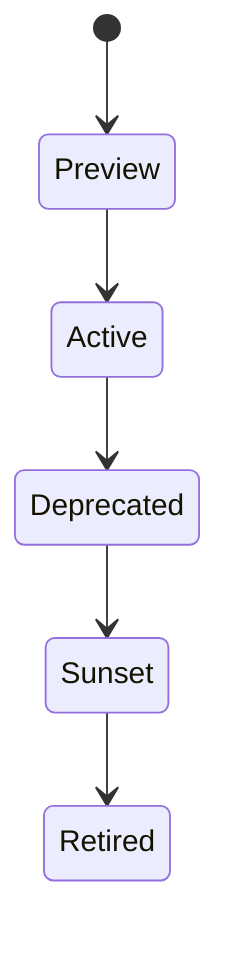

# Versioning Policy

## Scheme

Major versions are represented in the URI, for example `/v3.1/accounts`. Minor non-breaking changes are documented in OpenAPI metadata and changelog entries.

## Breaking Changes

- Removing an endpoint.
- Removing or renaming a field.
- Changing authentication requirements.
- Changing enum semantics.

## Non-Breaking Changes

- Adding optional fields.
- Adding new endpoints.
- Adding enum values when clients are instructed to handle unknowns.

