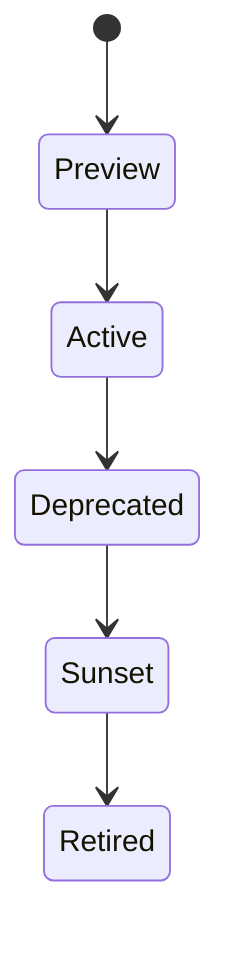

# Versioning Policy

## Scheme

Major versions are represented in the URI, for example `/v3.1/accounts`. Minor non-breaking changes are documented in OpenAPI metadata and changelog entries.

## Breaking Changes

- Removing an endpoint.
- Removing or renaming a field.
- Changing authentication requirements.
- Changing enum semantics.

## Non-Breaking Changes

- Adding optional fields.
- Adding new endpoints.
- Adding enum values when clients are instructed to handle unknowns.

## Lifecycle Rules

Preview APIs may change with limited notice and are used only for sandbox feedback. Active APIs are production-supported and covered by monitoring, incident communication, and compatibility rules. Deprecated APIs remain available during the notice period but include deprecation headers and migration documentation. Sunset APIs are blocked for new onboarding. Retired APIs return `410 Gone`.

The default production support window is one active major version plus the previous deprecated major version. Non-breaking changes are documented in the changelog and OpenAPI descriptions without changing the URI major version.
